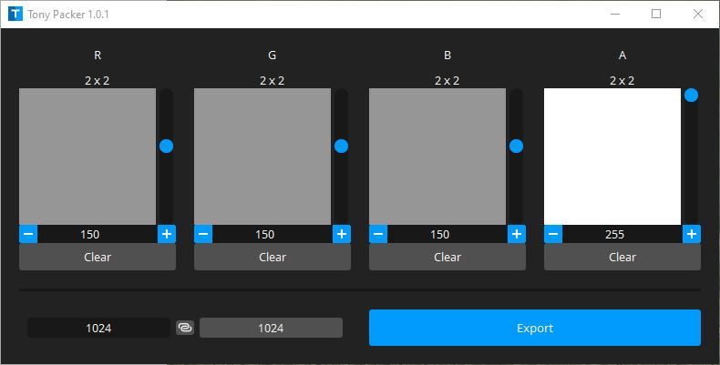
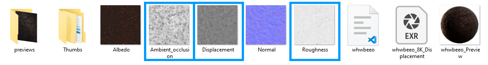
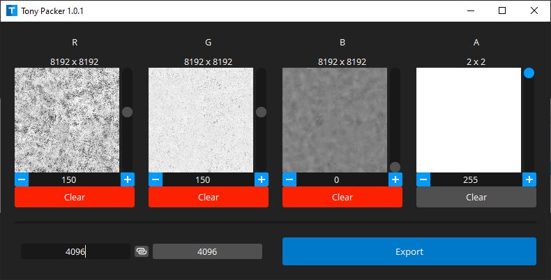

# Requirements

- src/requirements.txt

# Application

This tool can pack grayscale textures into RGBA format.
It can be useful if you want to [optimize textures](https://developer.arm.com/documentation/102696/0100/Texture-channel-packing) in a project.

# Example

For this example I have downloaded a set of textures from quixel bridge

I would like to have : 
- "Ambient_occlusion" as red channel
- "Roughness" as green channel
- "Displacement" as blue channel

Just drag and drop texture in the desired channel

And export the result with desired resolution and format

